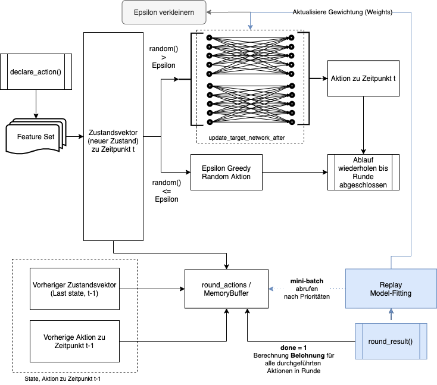
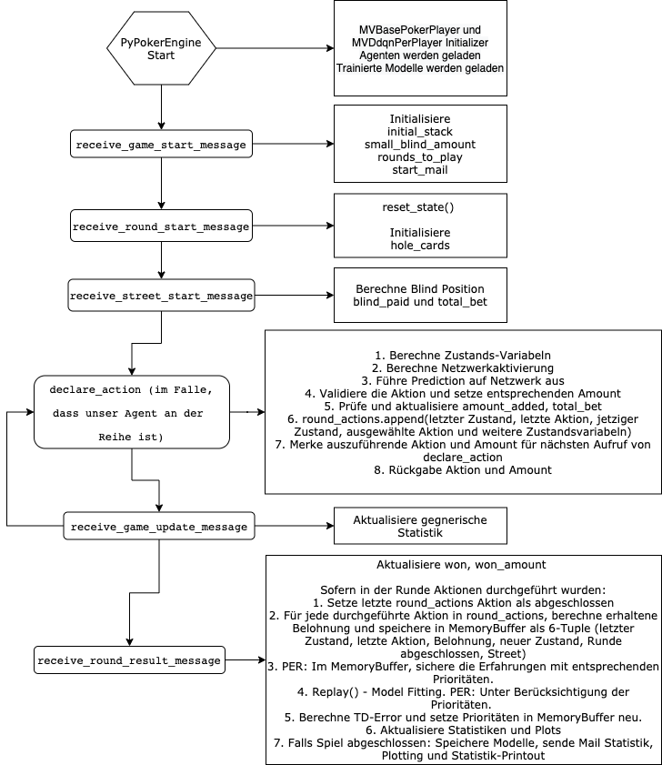

# Poker Bot Competition

This report describes models that can be applied to the well-known Texas Holdem Poker game (card game). The fundamental problems are explained and addressed by mathematical models. The focus is on the state space found in poker, non-deterministic prediction, and the credit assignment problem. Several agent compositions are implemented as reinforcement learning algorithms and use the temporal-difference learning method to autonomously detect patterns in the game. This generally leads to the implementation of a Double Deep Q Network with Prioritized Experience Replay model, which can achieve profit against different opponents. The agents compete against each other in local test runs, as well as on a platform tuned for this purpose, allowing direct comparisons of performance. Evaluations also show limits. The implementation is explained in Python using the Keras framework.

## Initialise venv

1. Generate venv: python3 -m venv venv
2. Execute shell script to start playing with 6 dqn bots: sh run_evaluation.sh 

## Execute

For execution, adjust agent composition as desired in runEvaluation.py.
The number of evaluation rounds can be specified in line #50.
The setup calls add_dqn_bots from configuration/CashGameConfig.py by default. The method registers six Ddqn and DdqnPer agents with different configurations. Different models are under [/source/Components](Components), including:

* Deep Q Network Model
* Double Deep Q Network Model
* Double Deep Q Network with Prioritized Experience Replay model

All models are developed from scratch. There are also some pre-programmed models in tensorflow, have a look at them.

## Double Deep Q Network with Prioritized Experience Replay Overview

### Flowchart DdqnPer
Sorry, thesis was in german

### MVBasePokerPlayer Ablauf

## Resources
Resources are in german.

[Developer Guide](resources/Developer_Guide.pdf)
[Bericht](Bericht.pdf)